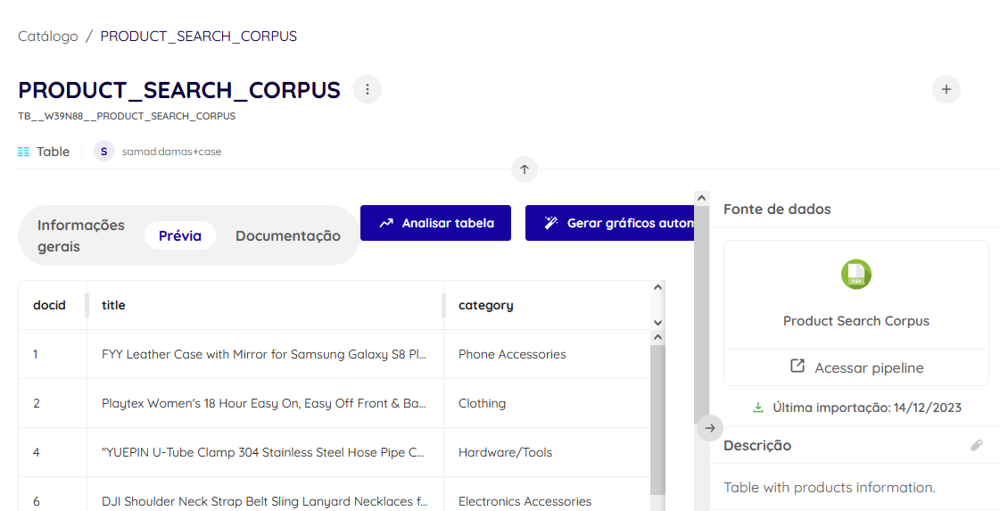
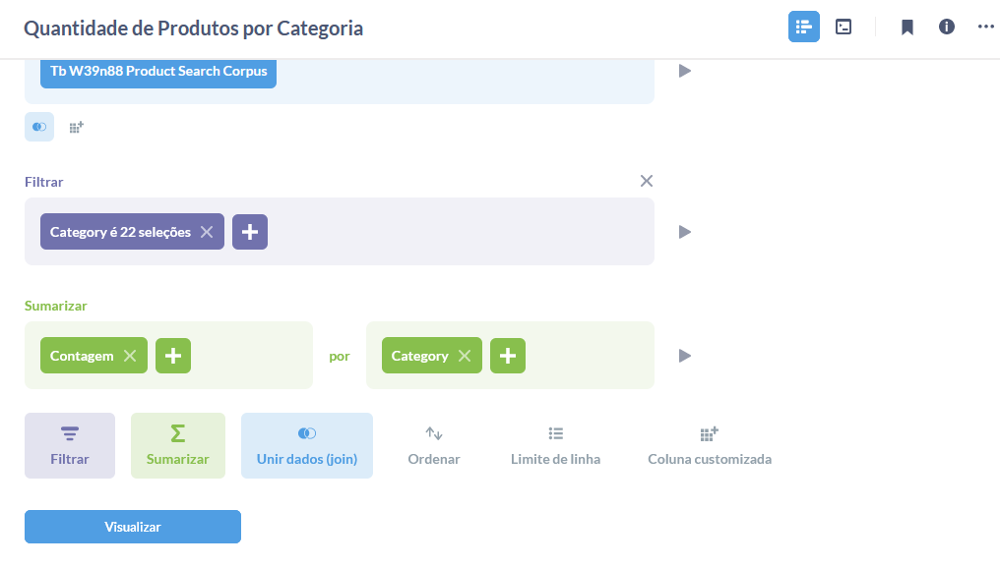
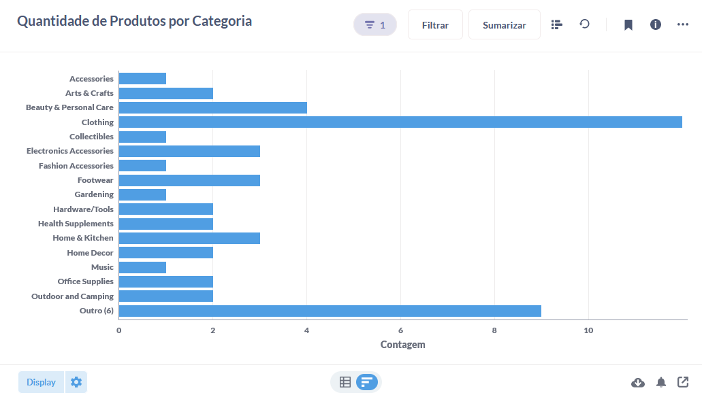
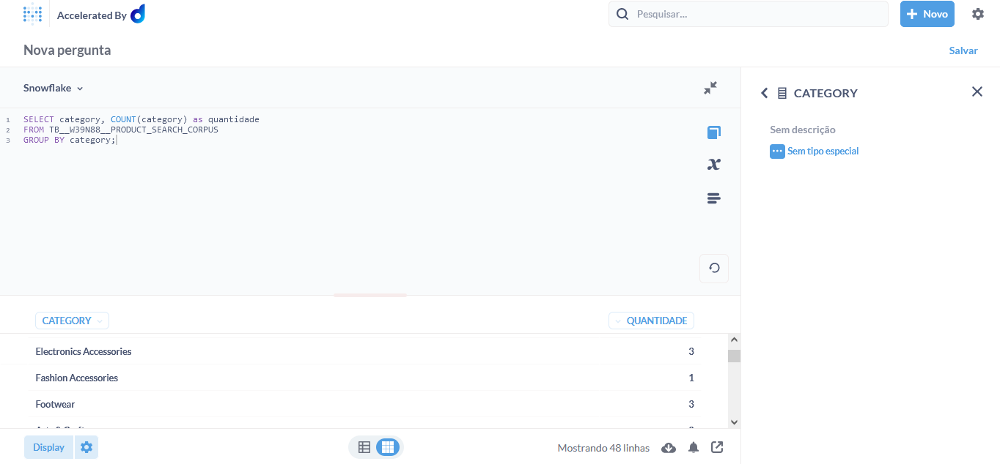
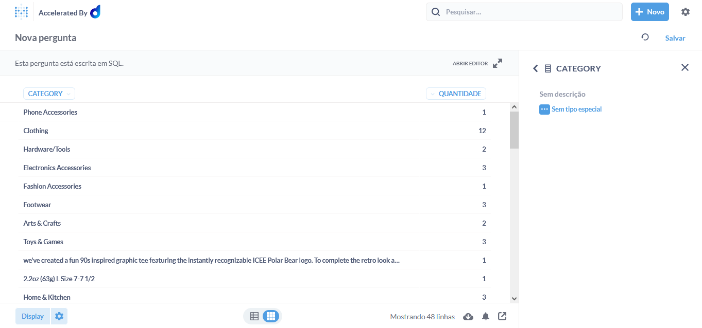
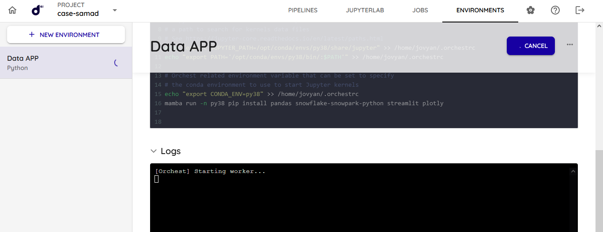

# Introdução

Durante a resolução desse case, após algumas tentativas, resolvi seguir com uma abordagem alternativa para algumas questões, mas que ainda demonstrassem meu conhecimento na área de dados. Na descrição dos itens abaixo, comento mais claramente sobre minha linha de raciocínio e a abordagem que tomei para solucionar os desafios propostos e problemas identificados durante o processo.

## Item 1
Para o item 1, realizei a gravação apresentando qual seria minha abordagem para propor uma solução de estruturação da plataforma da dadosfera que atendesse a necessidade do cliente e o objetivo de se ter a presença de modelos de IA para melhorar a experiência de compra dos clientes. Apresentei dois cenários, substituindo parcial e completamente a arquitetura atual do cliente. O vídeo está disponível no Youtube, no formato _não listado_.

Link para o vídeo da minha apresentação: https://www.youtube.com/watch?v=MfCu9HWggZ0

Link para minha apresentação na íntegra: [Presentation](presentation.md).

## Item 2

Para o item 2, utilizei o Google Colab para consumir a API onde os dados estavam armazenados e organizá-los em um DataFrame com o ID, título e descrição. Após a organização exportei os dados para uma planilha Excel, onde fiz uma limpeza, e adicionei as respectivas categorias geradas no Item 3. Posteriormente, fiz a carga desses dados na plataforma em formato CSV.

Link para o meu notebook no colab: https://colab.research.google.com/drive/1VuuYqIK3ntw-GQuegIfR3xX3M0FLlPNE?usp=sharing

## Item 3

Para a resolução do item 3, utilizei o ChatGPT (versão 3.5), por já estar familiarizado com a ferramenta. Abaixo, está um link com a conversa completa e todos os prompts que usei para fazer com que o ChatGPT gerasse os outputs desejados, em um formato que facilitasse para que eu os adicionasse na tabela. Utilizei engenharia de prompt para que ele compreendesse exatamente o formato de output esperado, e o que deveria ou não fazer. Isso, facilitou para que ele gerasse resultados consistentes, que atendessem com precisão a solicitação. Durante nossa conversa, realizei alguns ajustes para que ele mantesse a consistência, e pudesse aprender e se corrigir para os próximos resultados.

Link para minha conversa com o ChatGPT: https://chat.openai.com/share/04f2bc06-36e8-4790-84f6-6a3a0b6378f5

Link para o arquivo final com as features adicionadas: https://docs.google.com/spreadsheets/d/1ccm_h6dCiD9uXj0vqtEb4U_1sd0Bd2SLFub386TEByk/edit?usp=sharing

## Item 4

Para o item 4, acabei resolvendo de duas maneiras. A primeira, utilizando os atalhos e editor visual disponíveis após a catalogação dos meus dados: 

1. indo diretamente nos meus dados catalogados e escolhendo a opção "Analisar tabela"

.

2. realizando uma consulta direto no editor, onde filtrei as categorias que deveriam aparecer (após a importação apareceram algumas categorias que não estavam presentes no dataset. Pareciam ser uma cópia em parte de algumas descrições.) e selecionei a opção de sumarizar pela contagem de cada categoria.

.

3. e por fim, definindo o display como um gráfico de barras horizontal.

.

E a segunda, da maneira esperada para a resolução do case, realizando uma consulta SQL no Snowflake:

Query utilizada: SELECT category, COUNT(category) as quantidade
FROM TB__W39N88__PRODUCT_SEARCH_CORPUS
GROUP BY category;

.

 - No resultado, como mencionei no item dois da primeira maneira que resolvi a visualização dos dados para essa etapa, apareceram algumas categorias que foram resultado do processo de importação, e não vieram do dataset.

Como finalização do item 4, mantive a primeira abordagem de utilizar os auxílios visuais para a criação da visualização de dados dos produtos, devido a facilidade da utilização do filtro para a remoção das categorias que não fariam parte.

## Item 5

No item 5, segui os passos da documentação apresentada no case, mas em todas as tentativas, meu environment não foi criado. Permaneceu em um loop com o log de "Starting Worker". Talvez seja uma coisa acontecendo geral. Com isso, não consegui prosseguir para finalizar esse item 5. Contudo, fiquei bastante interessado em ver em ação o Data APP e poder testar um pouco. Compreendi os conceitos e os passos necessários para começar as análises dos dados anteriores, e gostaria de ver na prática.

.
