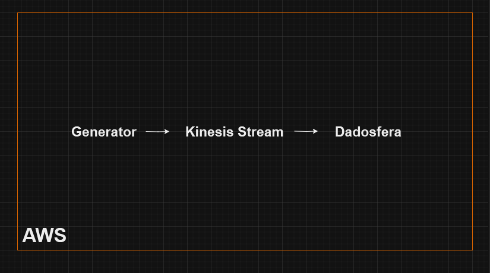
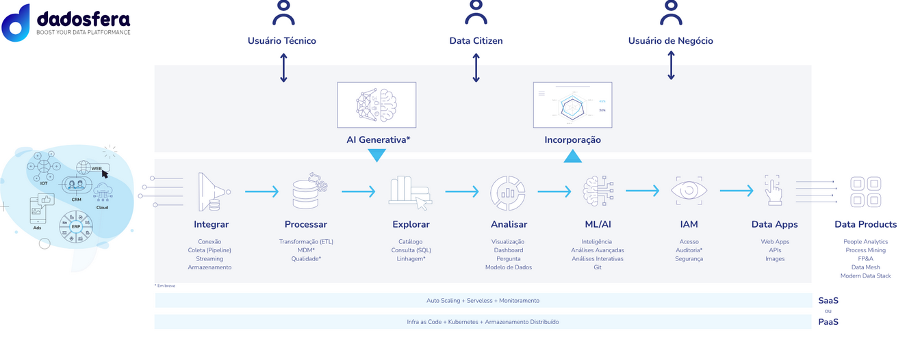

Case: Grande empresa de e-commerce

## 1. Principal Problema a ser Resolvido:

  Desafio Atual:
  Arquitetura atual baseada em Generator > Kinesis Stream > Firehose > S3 Bucket ou Redis Cluster pode apresentar desafios em termos de complexidade, escalabilidade e custos. A gestão e manutenção desse pipeline podem ser complexas, e a escalabilidade pode ser um problema.

  Solução Proposta:
  A Dadosfera oferece uma abordagem integrada e simplificada para gerenciar dados, proporcionando maior flexibilidade e escalabilidade. Simplificamos a coleta, processamento, consulta e visualização, tudo em uma plataforma unificada. Além disso, em nossa estrutura temos modelos de IA para melhorar a experiência de compra dos clientes.

## 2. Diagrama da Solução com Dadosfera, Arquitetura Proposta:

  Primeiro cenário:

  

  Segundo cenário:

  

## 3. Viabilidade Técnica e Econômica:

  Tecnicamente Viável:
    Integração Simples:
    A Dadosfera proporciona uma integração simplificada, eliminando a necessidade de vários componentes de AWS. Nossa plataforma unificada abrange todos os aspectos do seu pipeline de dados.

    Gerenciamento Descomplicado:
    Ao contrário da arquitetura atual, a Dadosfera oferece uma interface única para gerenciar todos os módulos, tornando o gerenciamento mais eficiente.

  Economicamente Acessível:
    Modelo de Preços Transparente:
    Nossos planos de suporte e preços competitivos garantem uma solução acessível e sem surpresas.

    Escalabilidade Eficiente:
    O modelo de escalabilidade da Dadosfera permite que você pague apenas pelos recursos que realmente usa, proporcionando eficiência de custos.

## 4. Oportunidades e Ganhos Futuros:

  Inovação Contínua:
    Novas Funcionalidades:
    Nossa plataforma é continuamente aprimorada, garantindo que você tenha acesso às últimas funcionalidades e inovações tecnológicas.

  Eficiência Operacional:
    Tempo de Implementação Reduzido:
    Ao adotar a Dadosfera, você reduzirá o tempo necessário para implementar novos recursos e soluções.

  Foco no Core Business:
    Concentre-se no que Importa:
    Deixe a gestão da infraestrutura conosco para que sua equipe possa se concentrar em impulsionar inovações no core business.

## Conclusão:

A Dadosfera não é apenas uma substituição para a arquitetura atual, mas uma evolução para uma plataforma de dados mais eficiente, ágil e econômica. Estamos prontos para trabalhar com você nessa jornada de transformação. Fico à disposição para discutir mais detalhes e responder a quaisquer perguntas.